## 初识webpack


webpack默认配置文件： webpack.config.js


#### webpack配置组成


#### 一个简单的例子

初始化一个项目：

```shell
npm init -y
```

安装 webpack webpack-cli


#### entry（依赖图的入口）


#### output

用来告诉webpack‘如何将编译后的文件输出到磁盘


## Loaders


webpack开箱即用只支持js和json两种文件类型，通过loaders去支持其他文件类型并转化成

有效的模块，可以添加到依赖图中。

本身是一个函数，接受源文件作为参数，返回转换的结果。


#### 常用loaders


## Plugins

插件用于bundle文件的优化，资源管理和环境变量注入

作用于整个构建过程


#### 常用plugins


## mode


## 解析es6

```shell
cnpm i @babel/core @babel/preset-env --save-dev
```


## 解析css

css-loader用于加载.css文件，并转换成commonjs对象

style-loader 将样式通过style标签插入到head中


## less

less-loader 用于见less转成css


## webpack中文件监听

文件监听是在发现源码发生变化时，自动重新构建出新的输出文件。

两种方式：

- webpack命令式，带上--watch参数
- 在配置文件webpack.config.js中设置watch:true

**缺点**：每次需要手动刷新浏览器


#### 文件监听原理分析

轮询判断文件的最后编辑时间是否变化

某个文件发生变化时，并不会立刻告诉监听者。而是先缓存起来等aggregateTimeout


## 热更新

#### 方式一：使用webpack-dev-server

WDS不刷新浏览器

WDS不输出文件，而是放在内存中

使用HotModuleReplacementPlugin插件


#### 方式二：使用webpack-dev-middleware

WDM将webpack输出的文件传输给服务器


### 热更新原理


Bundle server就是服务器，使得文件可以在服务器上访问，如localhost:8080


一般用到websocket


## 文件指纹策略

- Hash：和整个项目的构建相关，只要项目文件有修改，整个项目构建的hash值就会更改
- Chunkhash：和webpack打包的chunk有关，不同的entry会生成不同的chunkhash值
- Contenthash：根据文件内容来定义hash，文件内容不变，则contenthash不变


output文件一般chunkhash

css一般contenthash

图片字体的hash不太一样


## 代码压缩

- html压缩

  html-webpack-plugin

- css压缩

  使用optimize-css-assets-webpack-plugin + cssnano

- js压缩

  production默认开启 uglifyjs-webpack-plugin进行压缩


## 清理构建目录

clean-webpack-plugin


## PostCSS插件autoprefixer自动补齐CSS3前缀

postcss-loader + autoprefixer插件，添加browserslist配置项


## 移动端CSS px自动转换成rem

px2rem-loader，将px转rem；

页面渲染时，计算根元素的font-size值，可使用手淘的lib-flexible库；


## 资源内联

意义：

- 代码层面
  - 页面框架的初始化脚本
  - 上报相关打点
  - css内联避免页面闪动
- 请求层面
  - 减少http网络请求，小图片或字体内联（url-loader）


css内联：

- 方式一：style-loader
- 方式二：html-inline-css-webpack-plugin


**raw-loader使用0.5版本**

**html-webpack-plugin默认使用ejs模板引擎**


## 多页面打包通用方案

利用glob.sync，动态获取相应入口文件


## sourcemap

通过sourcemap定位到源码

开发环境开启，线上环境关闭


## 提取页面公共资源

1

**思路**：将react、react-dom、基础包通过cdn引入，不打包进bundle中

**方法**：html-webpack-externals-plugin

2

**利用SplitChunksPlugin进行公共脚本分离**，webpack4内置，替代CommonsChunkPlugin

参数:

- async，异步引入的库进行分离（默认）
- initial，同步引入的库进行分离
- all，所有引入的库进行分离

3

**利用SplitChunksPlugin分离基础包**


## tree shaking

引入的模块，tree shaking把用到方法打进bundle，没用到的在uglify阶段被擦除掉


**使用**：webpack默认支持，在.babelrc设置modules:false即可

**要求**：必须是es6语法，cjs方式不支持


production mode默认开启


#### DCE

- 代码不会被执行，不可达
- 代码执行的结果不会被用到
- 代码只会影响死变量（只写不读）


## ScopeHoisting使用和原理分析

**现象**：构建后的代码存在大量闭包代码

**问题**：

- 大量函数闭包包裹代码，导致体积增大（模块越多越明显）
- 运行代码是创建的函数作用域变多，内存开销变大


#### ScopeHoisting原理

将所有模块的代码按照引用的顺序放在一个函数作用域，然后适当的命名一些变量以防止变量名冲突


**使用**：

webpack4，production mode 默认开启

必须是es6语法，cjs不支持


## 代码分割和动态import

#### 场景

- 抽取公用代码
- 脚本懒加载，使得初始下载的代码更小


#### 懒加载js脚本

- CJS： require.ensure
- es6： 动态import（需要babel转换）


使用@babel/plugin-syntax-dynamic-import插件


## 集成ESlint

webpack+eslint


使用eslint-loader ，构建是检查js规范


## webpack打包库和组件

实现一个大整数加法库的打包

- 需要打包压缩版和非压缩版
- 支持AMD、CJS、ESM模块引入


## webpack实现ssr打包

#### ssr是什么

渲染：

html + css + js + data -> 渲染后的html


服务端：

- 所有模板等资源都存储在服务端
- 内网机器拉取数据更快
- 一个html返回所有数据


ssr核心：减少请求

优势：

- 较少白屏时间
- seo友好


## 优化构建时命令行显示的日志

现象：展示一大堆开发者不关注的日志


**friendly-errors-webpack-plugin**


## 功能模块设计


## 使用eslint规范构建脚本

- 使用eslint-config-airbnb-base
- eslint --fix 自动处理空格


## 冒烟测试

是指对提交测试的软件在进行详细深入的测试之前进行的预测试，目的是暴露导致软件需重新发布的基本功能失效等严重问题


- 构建是否成功
- 每次构建后，build目录是否有文件输出


## 持续集成

优点：

- 快速发现错误
- 防止分支大幅偏离主干


措施：

代码集成到主干之前，必须通过自动化测试。只要有一个测试用例失败，就不能集成。


#### 接入Travis CI

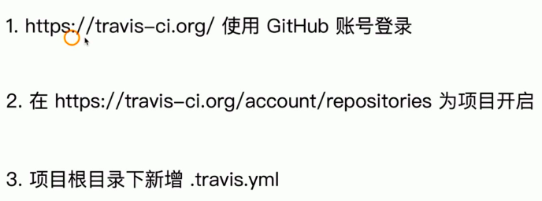


#### .travis.yml内容

- install项目依赖
- script运行测试用例


## 构建包发布npm

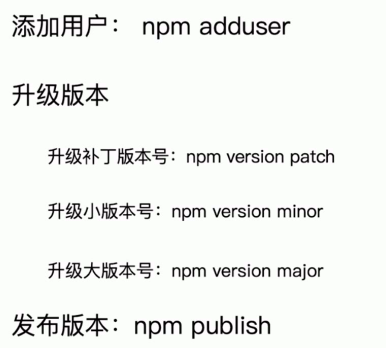


## Git规范和Changelog生成


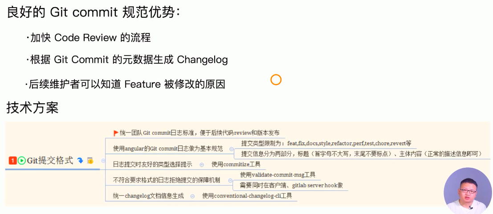


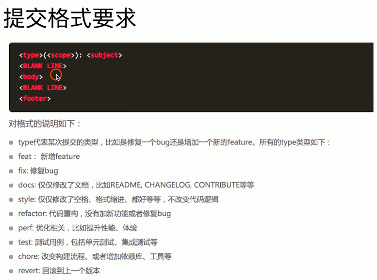


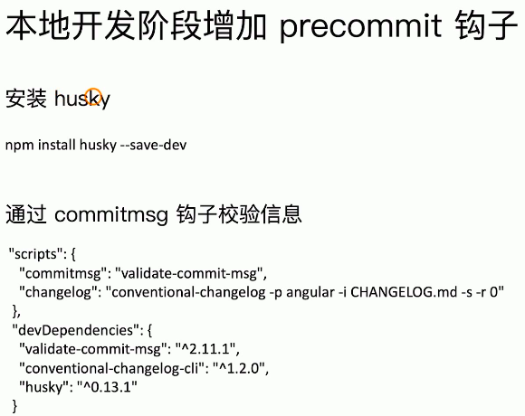


## 使用webpack内置的stats


## 速度分析

使用speed-measure-webpack-plugin，可以看到每个loader和plugin执行耗时


## 体积分析

webpack-bundle-analyzer


可以分析：

依赖的第三方模块文件大小

业务里面的组件代码大小


## 使用高版本webpack和node

性能提升


## 多进程多实例构建

资源并行解析可选方案

- thread-loader（webpack官方）
- parallel-webpack
- HappyPack


## 多进程多实例并行压缩

方式一：parallel-uglify-plugin

方式二：uglifyjs-webpack-plugin开启parallel参数

方式三：terser-webpack-plugin（webpack4，支持压缩es6）


## 进一步分包：预编译资源模块（也是可以提升打包速度）

思路：将react、react-dom、redux、react-redux基础包和业务基础包打包成一个文件

方法：使用DLLPlugin进行分包，DllReferencePlugin对manifest.json引用


## 充分利用缓存提升二次构建速度

思路：

- babel-loader开启缓存
- terser-webpack-plugin开启缓存
- 使用cache-loader或hard-source-webpack-plugin


## 缩小构建目标

目的：尽可能的少构建模块


比如babe-loader不解析node_modules


## 减少文件搜索范围

- 优化resolve.modules配置(减少模块搜索层级)
- 优化resolve.mainFields配置
- 优化resolve.extensions配置
- 合理使用alias


## 图片压缩

要求：基于node库的imagemin或者tinpng api


使用：配置image-webpack-loader


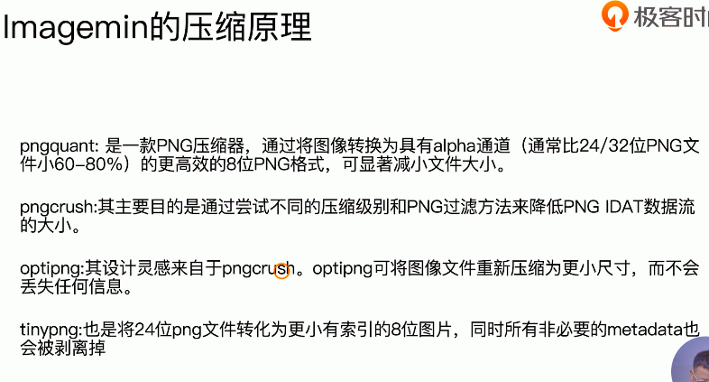


## 使用TreeShaking擦除无用的css

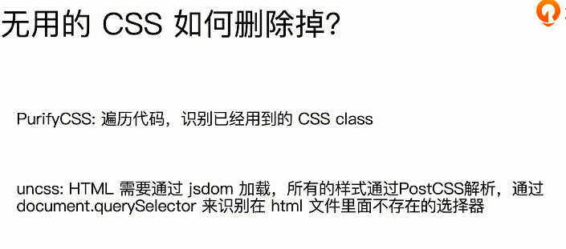


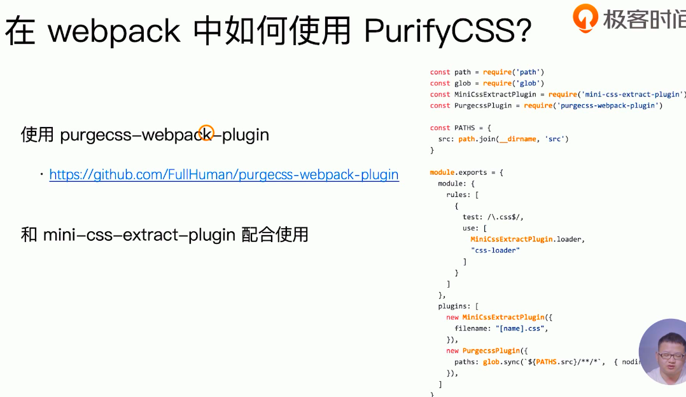


## 使用动态polyfill

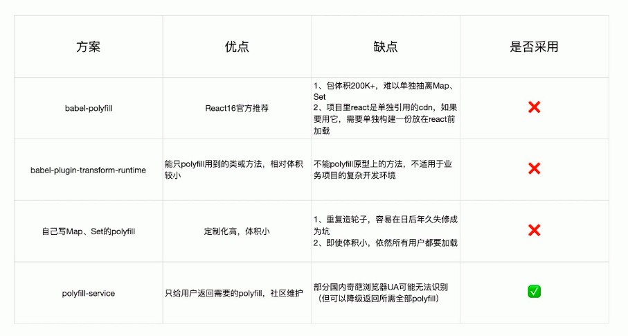

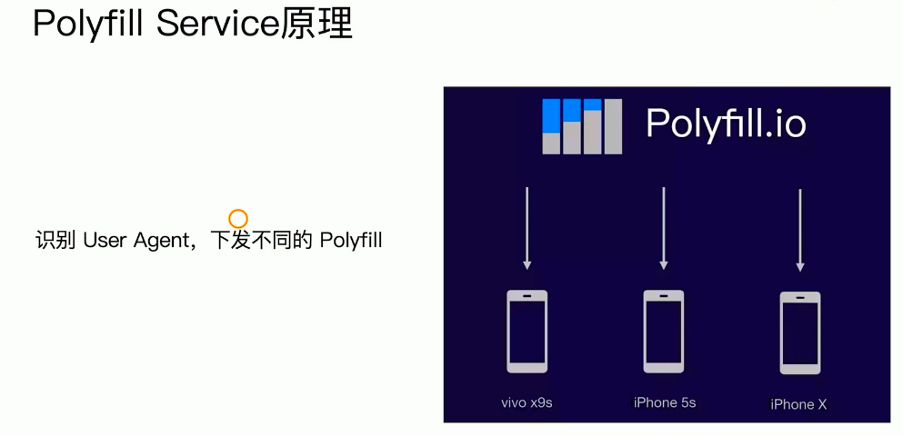


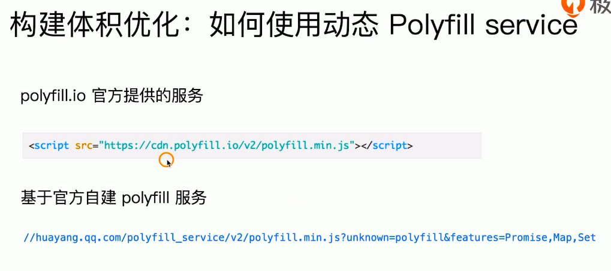

问题：国内一些浏览器改UA，影响下发

处理：执行失败时，把所有polyfill加载回来，降级方案


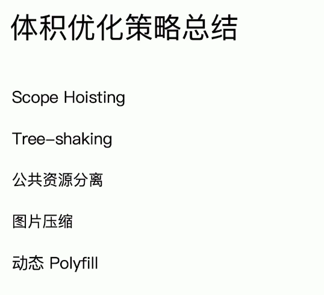


## 执行webpack命令

webpack启动后，流程会走到cli里面。webpack会判断 webpack-cli和webpack-command是否安装，两者都可用，只是webpack-cli的功能丰富些。如果两个都没安装，检查包管理器是npm 还是 yarn，提示安装，有以下选项。如果安装了一个就直接用。如果两个都安装了，就提示remove one of them。


## webpack-cli做了什么

- 引入yargs，对命令行进行定制
- 分析命令行参数，对各个参数进行转换个，组成编译配置项
- 引用webpack，根据配置项进行编译和构建

执行结果

webpack-cli对配置文件和命令行参数进行转换最终生成配置选项参数

最终会根据配置参数实例化webpack对象，然后执行构建流程


## webpack流程

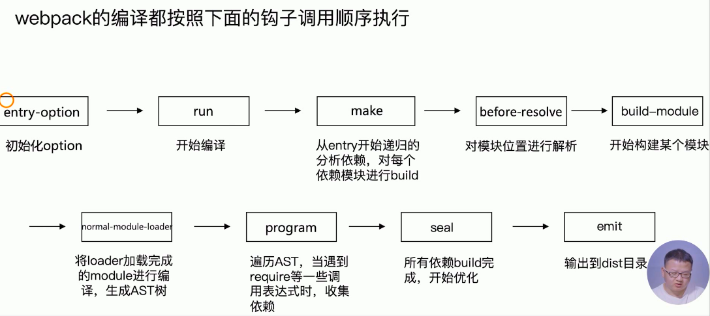


## 实现一个简易的webpack

目标

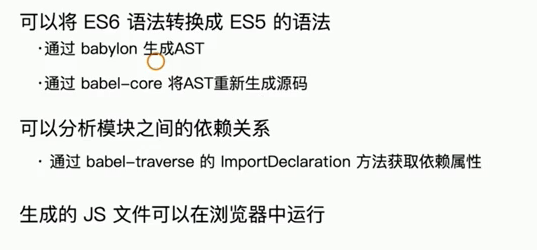


