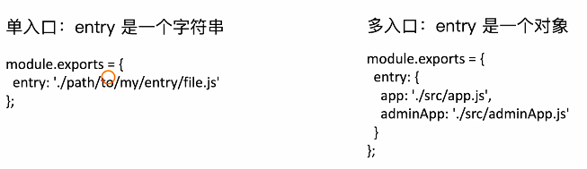
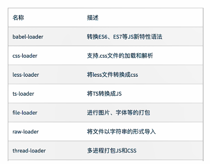
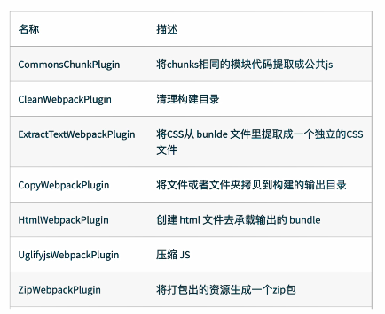
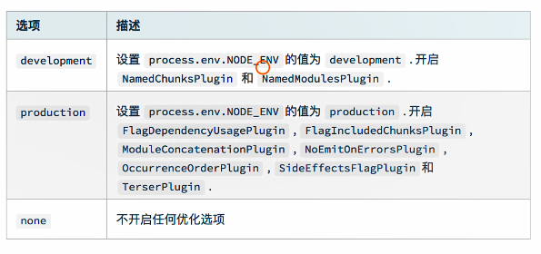

## 初识webpack


webpack默认配置文件： webpack.config.js


#### webpack配置组成


#### 一个简单的例子

初始化一个项目：

```shell
npm init -y
```

安装 webpack webpack-cli


#### entry（依赖图的入口）




#### output

用来告诉webpack‘如何将编译后的文件输出到磁盘


## Loaders


webpack开箱即用只支持js和json两种文件类型，通过loaders去支持其他文件类型并转化成

有效的模块，可以添加到依赖图中。

本身是一个函数，接受源文件作为参数，返回转换的结果。


#### 常用loaders




## Plugins

插件用于bundle文件的优化，资源管理和环境变量注入

作用于整个构建过程


#### 常用plugins




## mode




## 解析es6

```shell
cnpm i @babel/core @babel/preset-env --save-dev
```


## 解析css

css-loader用于加载.css文件，并转换成commonjs对象

style-loader 将样式通过style标签插入到head中


